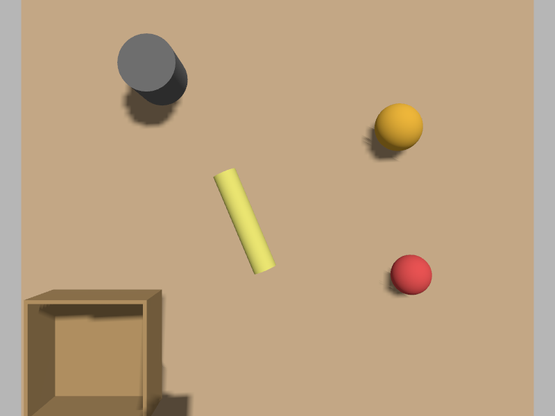

# gemini_robotics_ros

A ROS 2 (Jazzy) package that wraps the **Gemini Robotics-ER 1.6** vision-language
model and exposes its spatial reasoning — object detection, pointing, and
trajectory planning — as ROS services. Includes a Gazebo Harmonic tabletop
scene and a 2-finger parallel-jaw gripper that follows trajectories produced
by the model.

Based on the Google Gemini Robotics-ER **Getting Started** notebook:
<https://github.com/google-gemini/robotics-samples/blob/main/Getting%20Started/gemini_robotics_er.ipynb>

The notebook is pure Python with no robot integration; this package keeps the
prompt patterns and response parsing from the notebook and connects them to
ROS topics, services, a simulated camera, and a controllable gripper.

## Demo
Still a work in progress 
| Tabletop scene (overhead camera)
|---|---|
|  

The left image is the raw view from the simulated overhead camera in the
Gazebo `tabletop` world (apple, orange, banana, mug, basket on a wooden
table). The right image is the same view from the `/gemini_er/annotated_image`
topic after calling `/gemini_er/detect_objects` — Gemini Robotics-ER returned a
bounding box, which the node draws onto every subsequent live frame.

## What's in here

- **`er_vision_node`** — subscribes to a camera image, calls Gemini Robotics-ER
  on demand via `std_srvs/Trigger` services, publishes a continuous live
  annotated image stream and the structured detection results.
- **`pixel_to_world_node`** — back-projects normalized image-plane points onto
  a tabletop plane to produce 3D `nav_msgs/Path` waypoints.
- **`hand_controller_node`** — drives the floating parallel-jaw gripper through
  the planned 3D path.
- **`worlds/tabletop.sdf`** — Gazebo world with apple, orange, banana, mug,
  basket, an overhead simulated camera, and the gripper.
- **`models/parallel_jaw_gripper/`** — SDF for the 2-finger gripper with
  `JointPositionController` plugins on each finger.
- **`launch/gemini_er_demo.launch.py`** — brings up Gazebo, the
  ROS↔Gazebo bridges, and all three nodes.

## Quick start

See [`instructions.md`](instructions.md) for prerequisites, setup, and the
exact commands to run the demo.

## License

Apache-2.0.
